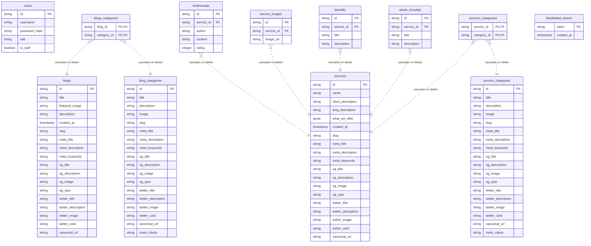

# Database Schema & Entity-Relationship (ER) Diagram

Below is the database schema for the local PostgreSQL database, mapped using Drizzle ORM.

---

## 1. Entity-Relationship (ER) Diagram

---

## 2. Table Schemas Description

### Users Table

- Stores account details for authentication.
- Field `is_staff` restricts write access (POST, PUT, PATCH, DELETE) to admin accounts.

### Blog Categories & Service Categories Tables

- `blog_categories` defines categories for blog posts (e.g. Tips, Guides).
- `service_categories` defines categories for cleaning services (e.g. Residential, Commercial).

### Blogs & Blogs-Categories Tables

- Stores articles and SEO metadata (inherited from SEOMixin fields).
- Many-to-many join table resolves blog posts with their respective blog categories.

### Services & Services-Categories Tables

- Core catalog table for cleaning services.
- Contains metadata, SEO fields, and a `what_we_offer` JSONB field for custom options.
- Many-to-many join table resolves services with their respective service categories.

### whats_included / benefits / service_images / testimonials Tables

- Relational child tables referencing `services.id`.
- Pushing/updating/deleting services cascades and cleans up these records automatically.
